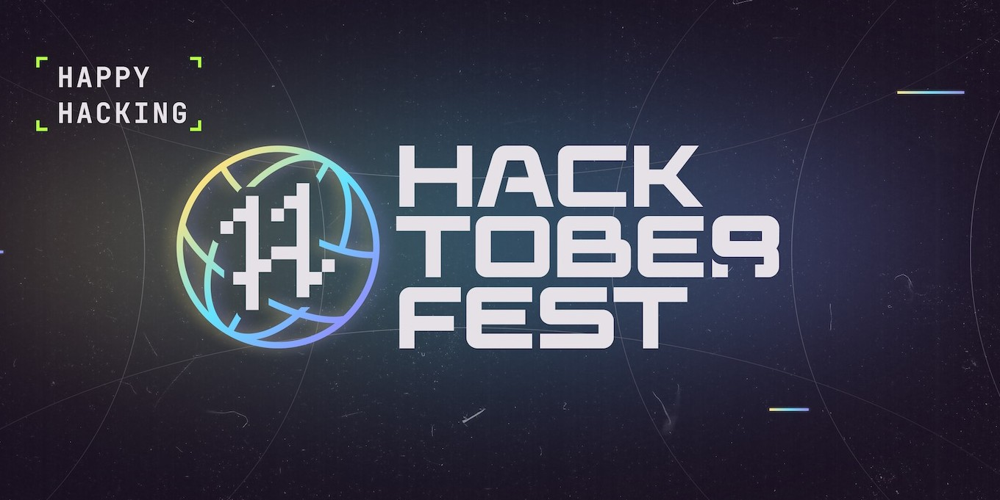

<strong>
A beginners friendly repository to help you get started with your Hacktoberfest 2022 journey🚀.
</strong>

## *How to Contribute*

If you have not contributed to hacktoberfest or any open-source software previously then follow these steps:

1. Go to Hacktoberfest [website](https://hacktoberfest.com/) and sign in there using your GitHub or Gitlab account.

2. Make sure you installed and setup Git on your local machine. If it isn't, download and install it from [here](https://git-scm.com/downloads).

3. Visit any repository shared below and read its README Instructions.

## Repositories which are beginner friendly:

<ol>

<a href=""> <li>Respository one</li></a>
<a href=""> <li>Repository two</li></a>
<a href=""> <li>Repository three</li></a>
<a href=""> <li>Repository four</li></a>
<a href=""> <li>Repository five</li></a>
<a href=""> <li>Repository six</li></a>

</ol>

